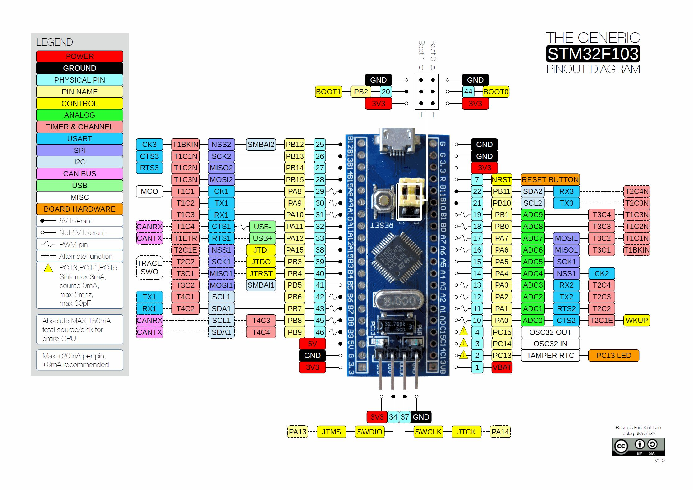

# Rust 寄存器嵌入式开发教程之 STM32F103

这是一个学习用 Rust 语言进行嵌入式开发的过程。记录了以寄存器的方式进行学习 STM32F103 开发板的案例。

如果需要 HAL 的示例可以查看另一个教程[Rust HAL 库嵌入式开发](https://github.com/silent-rain/stm32f103-tutorial)。


注：图片来源于网络

## 示例目录

### 延迟

- [汇编延迟](./src/bin/delay_asm.rs)
- [系统定时器延迟](./src/bin/delay_syst.rs)
- [TIM2 定时器延迟](./src/bin/delay_tim2.rs)

### GPIO

- [点亮 LED 灯](./src/bin/turns_led.rs)
- [闪烁 LED 灯](./src/bin/blinky_led.rs)
- [LED 流水灯](./src/bin/flow_light_led.rs)
- [按键控制 LED](./src/bin/flow_light_led.rs)
- [蜂鸣器](./src/bin/buzzer.rs)
- [光敏传感器控制蜂鸣器](./src/bin/light_sensor_control_buzzer.rs)

### 中断

- [对射式红外传感器触发中断计数](./src/bin/opposing_infrared_sensor_count_irq.rs)
- [按键中断控制 LED 灯](./src/bin/key_control_led_exti_irq.rs)
- [系统定时器中断](./src/bin/sys_tick_irq.rs)

## 编译与烧录

```shell
# 调试模式
cargo rb turns_led

# 生产模式
cargo rrb turns_led
```

## 参考文档

- [官方嵌入式](https://www.rust-lang.org/zh-CN/what/embedded)
- [stm32f1xx-hal](https://github.com/stm32-rs/stm32f1xx-hal)
- [Rust 嵌入式精选列表](https://github.com/rust-embedded/awesome-embedded-rust)
